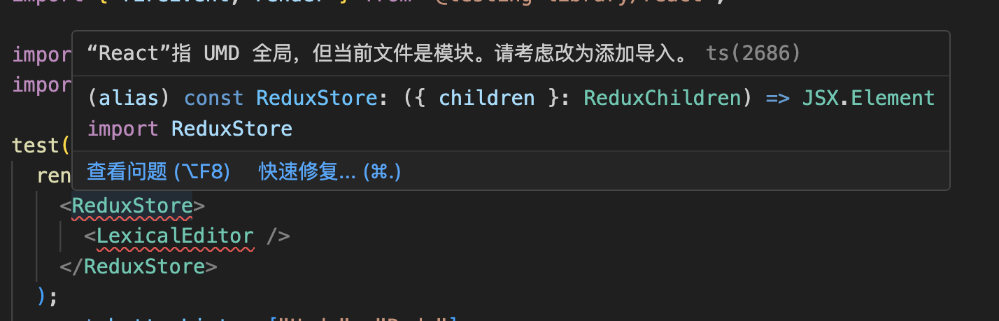

# 问题

## 在样式组件的背景中使用 svg 图像

**正确使用方法**

```jsx title="src/components/HelloDocusaurus.js"
import LOGO from './images/my-logo.svg';

const MyElement = styled.div`
  background-image: url('${LOGO}');
`
或者

const MyElement = styled.div`
  background-image: url('/my-logo.svg');
`
```

:::tip My Bug
错误使用

```
&.paragraph {
    background-image: url(${svgs.default.paragraph});
    }
```
正确使用：

```
&.paragraph {
    background-image: url("${svgs.default.paragraph}");
    }
```
只是一个引号的问题！！！

background-image : url( " " ) 

[background-image HTML 文档](https://www.w3schools.com/cssref/pr_background-image.php)
:::

## 禁用某些行、文件或文件夹的 ESLint

[ESLint文档:https://eslint.org/docs/latest/rules/max-len](https://eslint.org/docs/latest/rules/max-len)

[解决我问题的帖子：https://learn.coderslang.com/0023-eslint-disable-for-specific-lines-files-and-folders/](https://learn.coderslang.com/0023-eslint-disable-for-specific-lines-files-and-folders/)

:::tip quote

要禁用全部 ESLint 规则，而仅禁用某些特定的 ESLint 规则，您应该在同一注释中列出它们。用逗号分隔规则：

```
/* eslint-disable no-console, no-control-regex*/
console.log('JavaScript debug log');
console.log('eslint is disabled now');
```

规则eslint-disable和eslint-enable应始终放在块注释中。这不起作用：

```
// eslint-disable no-console, no-control-regex
console.log('JavaScript debug log');
console.log('eslint is disabled now');
```

忽略单行
要禁用单行 ESLint，有 2 个选项。

要关闭当前行的 linter，请在该行之后添加注释：

```
console.log('eslint is disabled for the current line'); // eslint-disable-line
```

要关闭下一行的 linter，请将注释放在要忽略的行之前：

```
// eslint-disable-next-line
console.log('eslint is disabled for the current line');
```

忽略多个文件或文件夹
要关闭整个文件中的 ESLint，您可以/* eslint-disable */在该文件的第一行添加。

.eslintignore或者，您可以在根目录中创建一个文件。该文件的格式与 的格式匹配.gitignore，您不仅可以添加文件，还可以添加目录。

```
build/*.js
config/*.js
bower_components/foo/*.js
```

:::

## React”指 UMD 全局，但当前文件是模块。请考虑改为添加导入


```
'react', 'react-jsx'
```
[react-jsx](https://stackoverflow.com/questions/62859458/)（与 React 17 相关）模式可以帮助您避免在使用 jsx 的每个文件中导入 React 的必要性

我们的原始代码不再需要[导入React来使用 JSX](https://legacy.reactjs.org/blog/2020/09/22/introducing-the-new-jsx-transform.html)

**我的错误：**

从编译中排除了[".test.ts", ".test.tsx"]等文件

**解决方案：**

修改tsconfig.json
```
delete
"exclude": ["**/*.test.ts", "**/*.test.tsx"]
```

## 在 Jest 中模拟 React 组件:[mock](https://robertmarshall.dev/blog/how-to-mock-a-react-component-in-jest/)

应该使用“jest.mock”函数。导出特定组件的文件被模拟并替换为自定义实现。由于组件本质上是一个函数，因此模拟也应该返回一个函数。从上面的示例开始，测试将如下所示：

```jsx title="src/components/HelloDocusaurus.js"
import React from "react";
import Modal from "./Modal";

const TopLevelComponent = ({ open }) => (
  <>
    <p>Some other content to render...</p>
    {open && <Modal />}
  </>
);

export default TopLevelComponent;
```

```jsx title="src/components/HelloDocusaurus.js"
import React from "react";
import { render } from "@testing-library/react";
import TopLevelComponent from "./TopLevelComponent";

jest.mock("./Modal", () => () => {
  return <mock-modal data-testid="modal"/>;
});

test("If TopLevelComponent is passed the open prop Modal is rendered", () => {
  const { queryByTestId } = render(<TopLevelComponent open />);
  expect( queryByTestId("modal") ).toBe(true)
});

test("If TopLevelComponent is not passed the open prop Modal is not rendered", () => {
  const { queryByTestId } = render(<TopLevelComponent />);
  expect( queryByTestId("modal") ).toBe(false);
});
```

:::tip My tips

**要让jest.mock在beforeEach中生效**，我们需要将其放在describe()**函数外面**，也就是在我们**整个测试文件的最顶层声明一次jest.mock**。这样就能保证在执行测试用例的时候，jest.mock会一直处于mock状态，被所有测试用例共享使用。

```jsx title="src/components/HelloDocusaurus.js"
jest.mock("./Modal", () => () => {
  return <mock-modal data-testid="modal"/>;
});
```

:::